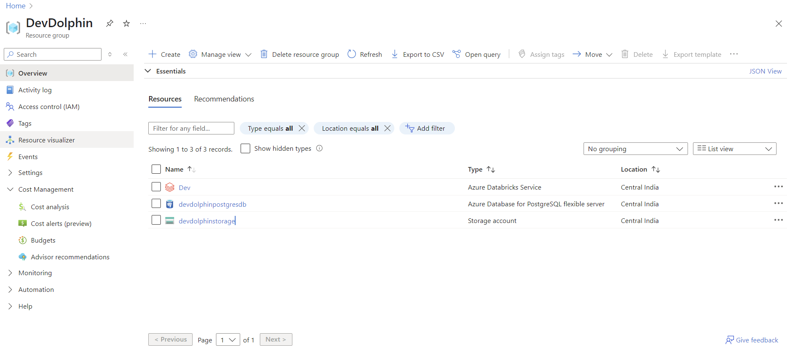

# PySpark Data Engineer - DevDolphins Assignment

##  Overview

This project addresses the offline assignment for the PySpark Data Engineer role at DevDolphins. The task involves simulating a real-time streaming pipeline for analyzing customer transactions using **PySpark on Azure Databricks**, integrated with **Azure Blob Storage**, **PostgreSQL**, and **Google Drive** as the data source.

---

## ✅ Current Progress

As of now, the following components have been successfully set up:

- ✅ **Google Drive API**:  
  - Authenticated using a service account  
  - Verified download functionality programmatically using Python  
  - Code for connecting and reading from Google Drive is included under `mechanism_x/`

- ✅ **Azure Databricks**:
  - Workspace and single-node compute cluster created  
  - Cluster configured with appropriate Spark settings  
  - Template JSON for cluster configuration included

- ✅ **Azure Blob Storage**:
  - A new storage account has been created  
  - Will be used for uploading transaction chunks and detection results  
  - Template config for Storage Account provisioning added

- ✅ **PostgreSQL on Azure**:
  - Flexible server instance created with free-tier configuration  
  - Manual stop strategy enabled to control costs  
  - Connection details extracted and saved for later use

- ✅ **Supporting Material**:
  - Sample screenshots of configurations (GCP, Azure, Databricks) are included in the `images/` folder  
  - Storage Account and Databricks cluster templates are provided under `templates/`

---

---

## 🔜 Next Steps

- [ ] Develop a processing pipeline that reacts to new data, detects specific patterns, and generates actionable outputs  
- [ ] Store relevant intermediary or stateful data in a database for reference and tracking  
- [ ] Organize all detection results and outputs in a structured and retrievable format in cloud storage  
- [ ] Finalize project structure, documentation, and demo materials for submission

---

## 🧑‍💻 Author

**Kushagra Verma**  
Email: kushagraid@gmail.com
LinkedIn: (https://www.linkedin.com/in/2kushagraverma3/)

---

*Note: More sections will be added as the project progresses.*

